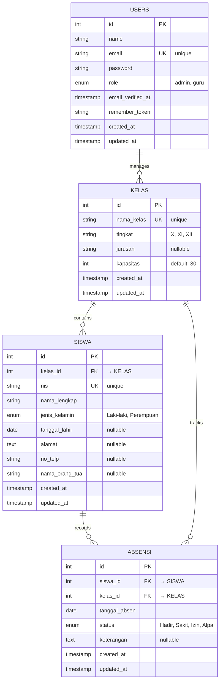

# ERD - Sistem Informasi Absensi Kelas (Diagram Mermaid)

Diagram di bawah ini menunjukkan struktur database dari Sistem Informasi Absensi Kelas.



## Penjelasan Struktur

### Tabel Users
**Fungsi:** Menyimpan data pengguna sistem (admin dan guru)

| Kolom | Tipe | Deskripsi |
|-------|------|-----------|
| id | int | Identifier unik (PK) |
| name | string | Nama pengguna |
| email | string | Email (unik) |
| password | string | Password terenkripsi |
| role | enum | admin atau guru |
| created_at | timestamp | Waktu pembuatan |
| updated_at | timestamp | Waktu update terakhir |

---

### Tabel Kelas
**Fungsi:** Menyimpan data kelas/rombongan belajar

| Kolom | Tipe | Deskripsi |
|-------|------|-----------|
| id | int | Identifier unik (PK) |
| nama_kelas | string | Nama kelas unik (contoh: X-RPL-1) |
| tingkat | string | Tingkat: X, XI, atau XII |
| jurusan | string | Jurusan: RPL, TKJ, dll (optional) |
| kapasitas | int | Kapasitas siswa (default 30) |
| created_at | timestamp | Waktu pembuatan |
| updated_at | timestamp | Waktu update terakhir |

**Relasi:**
- 1 Kelas → N Siswa (One to Many)
- 1 Kelas → N Absensi (One to Many)

---

### Tabel Siswa
**Fungsi:** Menyimpan data siswa

| Kolom | Tipe | Deskripsi |
|-------|------|-----------|
| id | int | Identifier unik (PK) |
| kelas_id | int | Foreign Key ke Kelas |
| nis | string | Nomor Induk Siswa (unik) |
| nama_lengkap | string | Nama lengkap siswa |
| jenis_kelamin | enum | Laki-laki atau Perempuan |
| tanggal_lahir | date | Tanggal lahir (optional) |
| alamat | text | Alamat rumah (optional) |
| no_telp | string | Nomor telepon (optional) |
| nama_orang_tua | string | Nama orang tua (optional) |
| created_at | timestamp | Waktu pembuatan |
| updated_at | timestamp | Waktu update terakhir |

**Relasi:**
- N Siswa → 1 Kelas (Many to One)
- 1 Siswa → N Absensi (One to Many)

**Constraint:** 
- Foreign Key kelas_id referensi ke Kelas.id
- Cascade Delete: Jika Kelas dihapus, semua Siswa di kelas tersebut terhapus

---

### Tabel Absensi
**Fungsi:** Menyimpan data kehadiran siswa

| Kolom | Tipe | Deskripsi |
|-------|------|-----------|
| id | int | Identifier unik (PK) |
| siswa_id | int | Foreign Key ke Siswa |
| kelas_id | int | Foreign Key ke Kelas |
| tanggal_absen | date | Tanggal absensi |
| status | enum | Hadir, Sakit, Izin, atau Alpa |
| keterangan | text | Catatan tambahan (optional) |
| created_at | timestamp | Waktu pembuatan |
| updated_at | timestamp | Waktu update terakhir |

**Relasi:**
- N Absensi → 1 Siswa (Many to One)
- N Absensi → 1 Kelas (Many to One)

**Constraint:**
- Foreign Key siswa_id referensi ke Siswa.id
- Foreign Key kelas_id referensi ke Kelas.id
- Unique Constraint (siswa_id, tanggal_absen): Mencegah duplikasi absensi dalam satu hari
- Cascade Delete: Jika Siswa dihapus, semua Absensi siswa tersebut terhapus

---

## Alur Data

### 1. Membuat Kelas
```
User (Admin) → Buat Kelas (nama_kelas, tingkat, jurusan, kapasitas)
↓
Tersimpan di tabel KELAS
```

### 2. Menambah Siswa ke Kelas
```
User (Admin) → Input Siswa (nis, nama, jenis_kelamin, dll)
↓
Pilih Kelas → Tersimpan di tabel SISWA dengan kelas_id
```

### 3. Mencatat Absensi
```
User (Guru) → Pilih tanggal dan Kelas
↓
Input status absensi setiap siswa
↓
Tersimpan di tabel ABSENSI (siswa_id, kelas_id, status, tanggal_absen)
```

### 4. Melihat Laporan
```
Admin/Guru → Query data dari tabel ABSENSI
↓
Join dengan SISWA dan KELAS untuk tampilkan nama siswa dan kelas
↓
Filter berdasarkan periode atau status
```

---

## Cascade Delete Behavior

### Jika Kelas dihapus:
```
DELETE FROM kelas WHERE id = X
↓
1. Otomatis hapus semua SISWA dengan kelas_id = X
2. Otomatis hapus semua ABSENSI dengan kelas_id = X
   (atau siswa_id yang merupakan siswa dari kelas X)
```

### Jika Siswa dihapus:
```
DELETE FROM siswas WHERE id = Y
↓
1. Otomatis hapus semua ABSENSI dengan siswa_id = Y
```

---

## Statistik & Query Umum

### Total siswa per kelas
```sql
SELECT k.nama_kelas, COUNT(s.id) as total_siswa
FROM kelas k
LEFT JOIN siswas s ON k.id = s.kelas_id
GROUP BY k.id;
```

### Kehadiran siswa dalam bulan
```sql
SELECT 
  s.nama_lengkap,
  COUNT(CASE WHEN a.status = 'Hadir' THEN 1 END) as hadir,
  COUNT(CASE WHEN a.status = 'Sakit' THEN 1 END) as sakit,
  COUNT(CASE WHEN a.status = 'Izin' THEN 1 END) as izin,
  COUNT(CASE WHEN a.status = 'Alpa' THEN 1 END) as alpa
FROM absensi a
JOIN siswas s ON a.siswa_id = s.id
WHERE MONTH(a.tanggal_absen) = 12 AND YEAR(a.tanggal_absen) = 2024
GROUP BY s.id;
```

### Siswa dengan absensi terbanyak
```sql
SELECT 
  s.nama_lengkap,
  COUNT(*) as total_absensi
FROM absensi a
JOIN siswas s ON a.siswa_id = s.id
GROUP BY s.id
ORDER BY total_absensi DESC
LIMIT 10;
```

